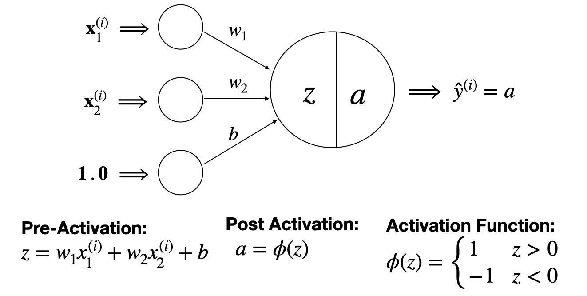

# The Perceptron

The Perceptron is a single neuron model with a *sign* activation function as depicted in the figure below that is used on binary classification problems and can take in any number of feature measurements:

# Datasets

I used the palmer_penguins dataset, which is a dataset that contains information about the island, bill length (mm), bill depth (mm), flipper length (mm), body mass (g), and sex of Adelie, Chinstrap, and Gentoo penguins. It was collected by Dr. Kristen Gorman and the Palmer Station in Antarctica.

# Libraries

The following packages are needed to reproduce my results:
matplotlib.pyplot
numpy
pandas
seaborn
mlxtend.plotting