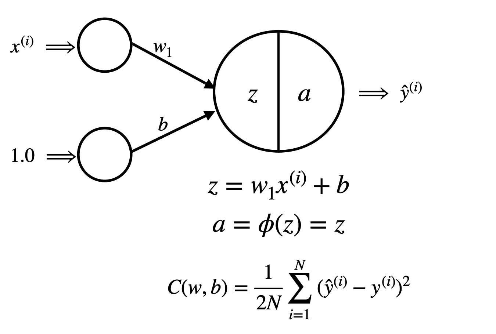

# Linear Regression

This sub-directory implements a single neuron linear regression model, which combines a single neuron model with the gradient descent algorithm to solve a linear regression problem. In Linear Regression, one aims to find an optimal linear target function which predicts and assigns real valued target labels to feature vectors.

# Datasets

I used the palmer_penguins dataset, which is a dataset that contains information about the island, bill length (mm), bill depth (mm), flipper length (mm), body mass (g), and sex of Adelie, Chinstrap, and Gentoo penguins. It was collected by Dr. Kristen Gorman and the Palmer Station in Antarctica.

# Libraries

The following packages are needed to reproduce my results:
matplotlib.pyplot
numpy
pandas
seaborn