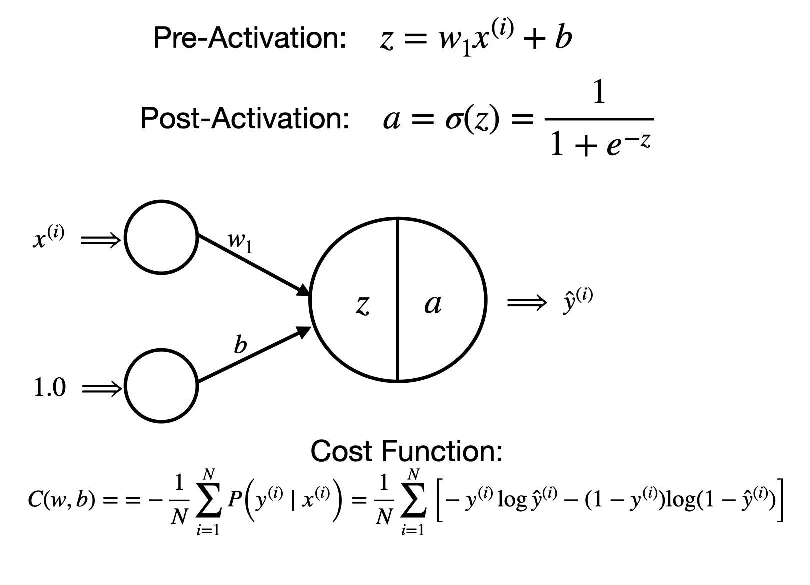

# Logistic Regression

In my previous binary classification problems with the Perceptron, I assumed that the data was linearly separable. However, in the non-linearly separable case, I will be modeling the probabilistic binary classification problem as a single neuron model with a sigmoid activation function and binary cross entropy loss function, trained with stochastic gradient descent. This single neuron will predict a class probability.

# Datasets

I used the palmer_penguins dataset, which is a dataset that contains information about the island, bill length (mm), bill depth (mm), flipper length (mm), body mass (g), and sex of Adelie, Chinstrap, and Gentoo penguins. It was collected by Dr. Kristen Gorman and the Palmer Station in Antarctica.

# Libraries

The following packages are needed to reproduce my results:
matplotlib.pyplot
numpy
pandas
seaborn
mlxtend.plotting