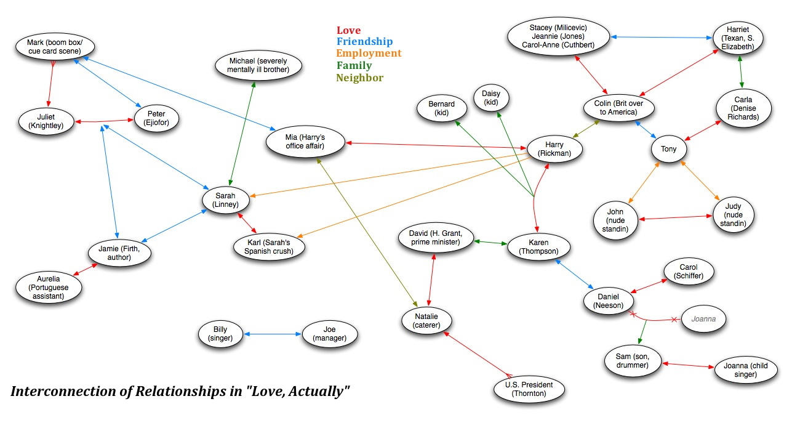
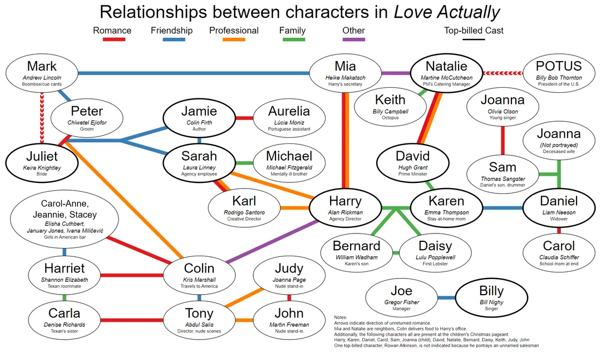

# Label Propagation

The Label Propagation algorithm is an undirected community detection algorithm. Community detection algorithms are unsupervised machine learning algorithms performed on graphs, which contain vertices and edges relating paris of vertices. They are similar to clustering except they are discrete not continuous. The idea behind Label Propagation is that vertices tend to adopt the label that the majority of their neighbors belong to.

# Datasets

I used my own data for this algorithm. While looking for a dataset to use to implement Label Propagation, I came across a Star Wars Social Network dataset: https://gist.github.com/codingthat/be03565bd97e789a3835b50235ad562f. While I do love Star Wars, when I think of a movie that contains an intertwined social network with surprising connections, I think of the classic Christmas rom-com: Love Actually. I used these two images as my baseline for creating my social network, and then let my label propagation algorithm run to see what communities it identified in the Love Actually social network:

# Libraries

The following packages are needed to reproduce my results:
matplotlib.pyplot
networkx